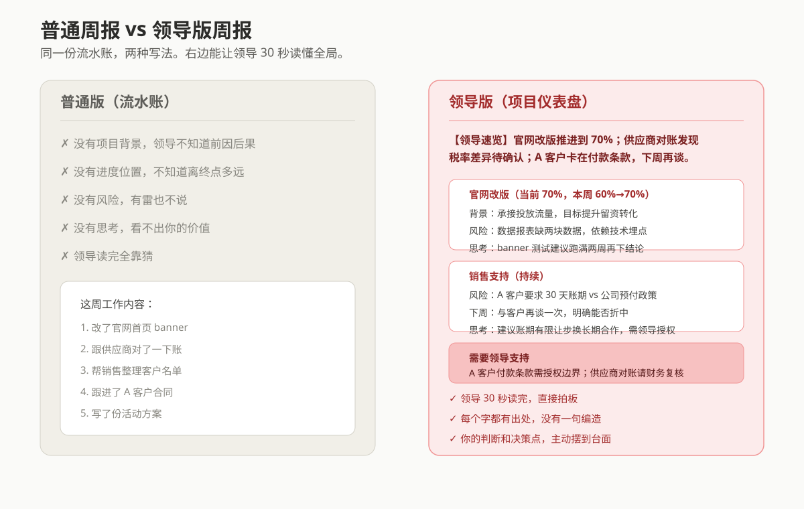

# hs-weekly-report

把"只讲事的流水账周报"，升级成"领导 30 秒读懂全局"的结构化周报。

一个面向打工人与自由职业者的 AI Skill：你把本周干的事随便写下来（碎碎念就行），它通过四步流程，产出一份可直接发出的领导版周报。

## 为什么需要它

普通周报是"事清单"：我改了首页、我对完了账、我跟进了客户。

领导同时管很多项目，没时间、没上下文，也不会去猜每件事背后的前因后果。普通周报对他来说等于没写：不知道项目背景、不知道还要多久、不知道有没有风险、不知道你有没有思考。

这个 Skill 把周报改造成**项目仪表盘 + 你的判断**，让领导 30 秒读懂全局。



## 核心设计：四步流程

| 步骤 | 内容 |
| --- | --- |
| 第 1 步 | 建项目库（一次性）：项目名 / 目标 / 预期结果 / 周期，之后每周复用 |
| 第 2 步 | 丢流水账：用户随便写本周干了啥，AI 拆成事实颗粒并归到项目 |
| 第 3 步 | 追问补缺：风险、下周计划、思考这三样没写的必须追问，**绝不编造** |
| 第 4 步 | 六要素组装：背景 / 位置 / 产出 / 风险 / 下一步 / 思考，输出领导版周报 |

**铁律：输出的每一个字都有出处。** 要么来自项目库，要么来自用户补充，AI 不替你编背景、进度、风险和思考。这是它和市面上"AI 写周报"prompt 的本质区别。

## 输出结构

```
# 本周周报（第 X 周）

【领导速览】两到三行，领导唯一必看部分

## 项目A（当前 70%，本周 55%→70%）
- 背景 / 本周产出 / 风险 / 下周 / 思考

## 需要领导支持
- 主动把决策点摆出来
```

## 安装与使用

### 方式一：一键安装（Mac 用户，推荐）

打开电脑自带的「终端」App，粘贴这一行，回车：

```bash
curl -fsSL https://raw.githubusercontent.com/handsomeng/hs-weekly-report/main/install.sh | bash
```

装完直接对你的 AI 说「帮我写周报」就能用。

### 方式二：手动安装（所有系统通用）

1. 打开 [GitHub 仓库](https://github.com/handsomeng/hs-weekly-report)，点绿色 `Code` 按钮 → `Download ZIP`
2. 解压后，把里面的文件夹整个放进你电脑的 skills 目录：
   - WorkBuddy 用户：`~/.workbuddy/skills/`
   - 其他客户端：放到对应的 skills 文件夹即可
3. 装完对你的 AI 说「帮我写周报」

### 方式三：任意 AI 对话工具（不安装直接用）

复制 `references/quick-start.md` 里那段话，把"我这周干的事"换成你的内容，发给任意 AI 对话框（豆包 / DeepSeek / 通义 / ChatGPT 等均可），3 分钟出一份周报。不需要安装任何东西。

## 项目结构

```
hs-weekly-report/
├── SKILL.md                          # Skill 定义与四步流程
├── install.sh                        # 一键安装脚本
├── assets/demo.svg                   # 对比演示图
└── references/
    ├── quick-start.md                # 快速开始：安装指引 + 一句话用法
    ├── prompt-template.md            # 完整 Prompt 模板
    └── example.md                    # 完整流程演示（流水账 → 领导版周报）
```

## 演示效果

| | 普通版 | 领导版 |
| --- | --- | --- |
| 领导读完 | 知道你很忙，不知道项目咋样 | 30 秒掌握全部项目状态 |
| 背景 | 无 | 每项目一句话说清 |
| 进度 | 无 | 每项目有百分比和本周增量 |
| 风险 | 无 | 全部标出 |
| 判断 | 无 | 真思考，能看出你值不值钱 |
| 可发出 | 不敢发 | 直接发 |

完整演示见 `references/example.md`。

## License

MIT
